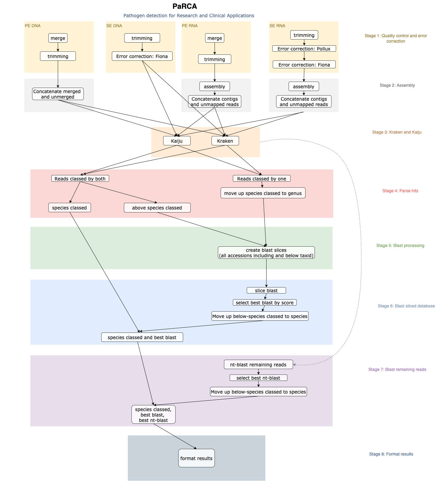

<p align="center" >
  PaRCA
</p>

## Pathogen detection for Research and Clinical Applications

---
## Prerequisites:
* Databases for Kraken and Kaiju are currently manually downloaded 
* Pollux and Fiona are not available from conda and has to be manually downloaded
* The workflow uses the singularity definition file in workflows/containers/parca_v1.def which should be built prior to running the pipeline.

## **Pipeline wrapper**

General:
- the snakemake API could not import a nested divtionary and had to be converted to a list of dictionaries. The pipeline will then convert this list into a nested dictionary where the keys will be <start_date>_<run_id> encoded from the runinfo.

## **The pipeline**
The pipeline is made for assigning sequencing reads to taxonomic identifiers.
It handles four cases, see steps in `parca/dag/dag_all.png`:
* SE RNA
* PE RNA
* SE DNA
* PE DNA

### Stage 1: Quality control and error correction
* `workflows/snakemake_rules/stage1_qc_trim_ec/setup/setup.smk`
  * Check if it is possible to skip interleaving files and instead work directly on PE reads.
* `workflows/snakemake_rules/stage1_qc_trim_ec/quality_control/fastqc.smk`
* `workflows/snakemake_rules/stage1_qc_trim_ec/trimming/bbduk_trimming.smk`
  * Adapters should be input as a path or as NA in meta dataframe
* `workflows/snakemake_rules/stage1_qc_trim_ec/ec_pollux/ec_pollux.smk`
* `workflows/snakemake_rules/stage1_qc_trim_ec/ec_fiona/ec_fiona.smk`

### Stage 2: Assembly
* `workflows/snakemake_rules/stage2_assembly/megahit/megahit.smk`
* `workflows/snakemake_rules/stage2_assembly/bbwrap_alignment/bbwrap_alignment.smk`
  * PE RNA: merged and unmerged bbmap coverage is added to the same file. The header for both files is included which starts with "#", check if this is handled correctly in latter steps! 
  * PE/SE RNA: Maybe remove the contigs that nothing was mapped back to?
* `workflows/snakemake_rules/stage2_assembly/merge_contigs_unmapped/merge_contigs_unmapped.smk`

### Stage 3: Kraken and Kaiju
* `workflows/snakemake_rules/stage3_kraken_kaiju/kraken_rules/kraken.smk`
* `workflows/snakemake_rules/stage3_kraken_kaiju/kaiju_rules/kaiju.smk`

### Stage 4: Parse hits
* `workflows/snakemake_rules/stage4_parse_hits/parse_hits.smk`
* `workflows/snakemake_rules/stage4_parse_hits/taxonomy_processing.smk` 
  * rule filter_SGF_empty: 
    * Doublets that had either species OR genus OR family was not added to a file. *Revisit this*
	* Revisit comparison between kraken and kaiju for SGF empty.
	  * Matching length (kaiju) is compared with (length-30)*(C/Q)+0.5 where C is the number of kmers matching the LCA and Q corresponds to the number of kmers that where queried agains the db (kraken)
  
### Stage 5: Blast processing
* `workflows/snakemake_rules/stage5_blast_processing/blast_processing.smk`

### Stage 6: Blast sliced database
* `workflows/snakemake_rules/stage6_blast_sliced_db/blast_above_species_classed.smk`

### Stage 7: Blast remaining reads
* `workflows/snakemake_rules/stage7_blast_remaining_reads/blast_remaining.smk`

### Stage 8: Format results
* `workflows/snakemake_rules/stage8_format_results/format_results.smk`

## Usage

```
cd /apps/bio/dev_repos/parca/parca;
snakemake \
    -rp \
    -s main.smk \
    --cluster-config config/cluster.yaml \
    --profile qsub_profile
```

### To-Do
* Comments on what to add to future updates are added to the previous section "The pipeline" with specifications for certain rules and snakemake files.

### Pipeline overview

