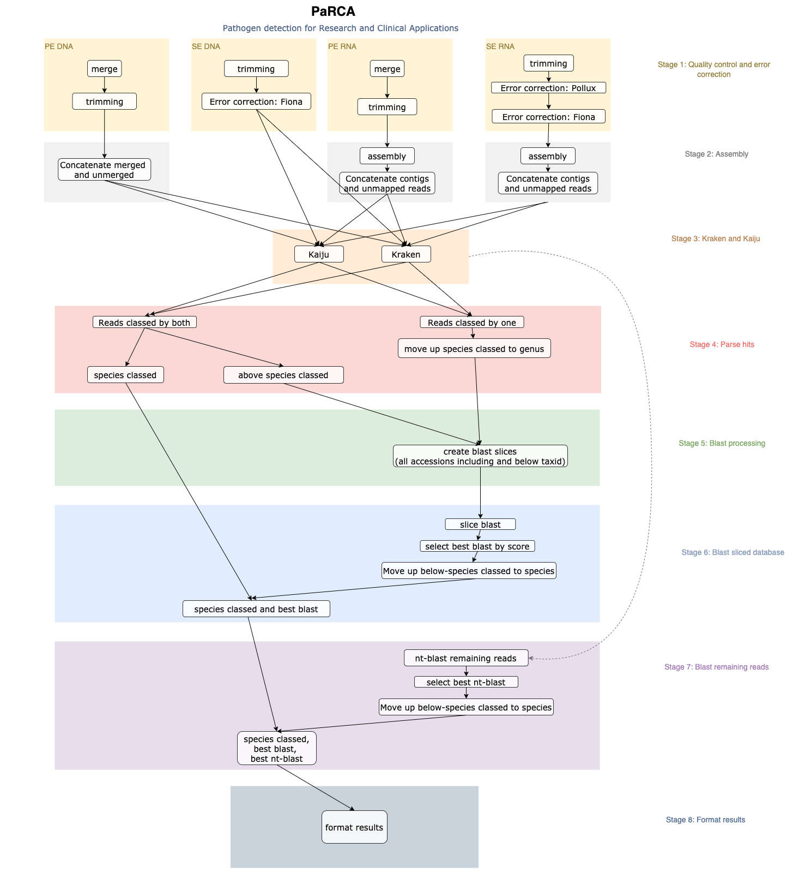

<h1 align="center" >
  P a R C A
</h1>

## Pathogen detection for Research and Clinical Applications

---
## Info

A snakemake pipeline to further develop the previous inhouse perl pipeline [Pathfinder](https://github.com/ClinicalGenomicsGBG/pathfinder_43b_perl) used for classifying metagenomic samples.

## Usage
The pipeline is started using the python wrapper `parca/parca_cli.py`. 
To see all settings, run:
```
python3 parca/parca_cli.py run --help
```

It is required to give a file containing runinfo and a file containing metadata to the pipeline. The sample information is parsed from these files. Currently only csv files are supported.

A runinfo file should have one column called `start_date` and another column called `run_id`. The column names following these two columns are the short names for samples which will be referred to on the rows of the metadata file. A short name for a sample can be called for example `sample_A` or `sample_B`, do not use spaces in the short names. A runinfo file can contain the run information for multiple different analyses and these are encoded from the rows of this file. The name of one analysis is inferred by the wrapper by joining the `start_date` with the `run_id` and will be separated by a `_`. The row element for a short name of a sample will encode if this sample should be included on the analysis called after the merging of `start_date` and `run_id`. Leaving the field empty means that this sample should not be included in the analysis whereas setting this field to `1` means that this sample should be used as a case sample in the analysis. If this analysis should have a control sample, one should set the row element of the control sample short name to `0`. It is not possible to only run control samples. If one sample should be included in the analysis, these should be encoded as a `1`. Also an analysis row can only contain one and only one case. If you want to run multiple samples then these should be on separate rows.
The row elements of `start_date` are only allowed to contain integers or `-`.


This is an example of how a runinfo file should look like if you want to start two different analyses on the pipeline. In this case there are three samples given in the runinfo file, remember to add more columns if you want to include more samples. The first row will create an analysis called `20210126_run_1` where `sample_1` will be used as the case and `sample_2` as control. The second row will create analysis called `20210126_run_2` where `sample_3` will be used as the case sample.

| start_date | run_id | sample_1 | sample_2 | sample_3 |
|---|---|---|---|---|
| 20210126 | run_1 | 1 | 0 |  |
| 20210126 | run_2 |  |  | 1 |

The metadata file should contain information about the short sample names referred to in the column names of the runinfo file. The column names of the metadata should be called `sample_id`, `nucleotide`, `fwd_or_rev`, `path_to_file` and `adapters`. The row elements of the column `sample_id` should have the same names as the column names of the short sample names in the runinfo file. The column `nucleotide` should be set to either `DNA` or `RNA` in capital letters. The column `fwd_or_rev` should be set to `fwd` in the case of single end samples and to either `fwd` or `rev`in lower case letters if the samples are paired end, using `fwd` on one row and `rev` on another. The column `path_to_file` should be the path to a fastq file, either gzipped or not. The column `adapters` should be left empty of no adapters should be trimmed and should otherwise be a path to a file containing adapters.

This is an example of how a metadata file should look like for the corresponding runinfo file above. `sample_1` and `sample_2` are RNA single end samples whereas `sample_2` is a paired end DNA sample and is therefore encoded on two rows, one linking to the forward sample and one linking to the reverse sample.

| sample_id | nucleotide | fwd_or_rev | path_to_file | adapters |
|---|---|---|---|---|
| sample_1 | RNA | fwd | /path/to/rna_file.fastq |  |
| sample_2 | RNA | fwd | /path/to/another_rna_file.fastq |  |
| sample_3 | DNA | fwd | /path/to/dna_file_fwd.fastq |  |
| sample_3 | DNA | rev | /path/to/dna_file_rev.fastq |  |

```
module load anaconda3;
source activate parca_v1;

# Dryrun demo
python3 parca/parca_cli.py run \
  -m /apps/bio/dev_repos/parca/demo/runinfo/metadata.csv \
  -r /apps/bio/dev_repos/parca/demo/runinfo/runinfo.csv \
  -o /medstore/logs/pipeline_logfiles/parca \
  -w /medstore/logs/pipeline_logfiles/parca/webinterface \
  --dryrun


# Run demo
python3 parca/parca_cli.py run \
  -m /apps/bio/dev_repos/parca/demo/runinfo/metadata.csv \
  -r /apps/bio/dev_repos/parca/demo/runinfo/runinfo.csv \
  -o /medstore/logs/pipeline_logfiles/parca \
  -w /medstore/logs/pipeline_logfiles/parca/webinterface
```

## Flask app

## Results

[PaRCA App](http://seqstore.sahlgrenska.gu.se:8008/parca/)

## Logs


## Installation

### Prerequisites:
* Databases for Kraken and Kaiju are currently manually downloaded 
* Pollux and Fiona are not available from conda and has to be manually downloaded
* The workflow uses the singularity definition file in workflows/containers/parca_v1.def which should be built prior to running the pipeline.

### Create the main conda environment
```
conda env create -f parca/workflows/conda/main.yaml
```

### Pull down images
Use Singularity to pull down the images used in the pipeline.

```
singularity pull docker://pericsson/bbmap_env:latest
singularity pull docker://pericsson/biopython_env:latest
singularity pull docker://pericsson/blast_env:latest
singularity pull docker://pericsson/kaiju_env:latest
singularity pull docker://pericsson/krona_env:latest
singularity pull docker://pericsson/r_env:latest
singularity pull docker://pericsson/taxonkit_env:latest
```
Refer to the download location in the `parca/config/config.yaml`, see variables `singularity_bbmap_env`, `singularity_biopython_env`, `singularity_blast_env`, `singularity_kaiju_env`, `singularity_krona_env`, `singularity_R_env`, `singularity_taxonkit_env`.


## The pipeline
The pipeline is made for assigning sequencing reads to taxonomic identifiers.
It handles four cases SE RNA, PE RNA, SE DNA and PE DNA and can be run with or without a control sample. See an example of a DAG for calling the pipeline with a case and control sample and also using only a case sample in `parca/dag/dag_case_control_case.png`.

### Pipeline overview


### Pipeline wrapper
This is where the 

Note:
- the snakemake API could not import a nested dictionary and had to be converted to a list of dictionaries. The pipeline will then convert this list into a nested dictionary where the keys will be <start_date>_<run_id> encoded from the runinfo.

### Stage 1: Quality control and error correction
* `workflows/snakemake_rules/stage1_qc_trim_ec/setup/setup.smk`
  * For future update: Check if it is possible to skip interleaving files and instead work directly on PE reads.
* `workflows/snakemake_rules/stage1_qc_trim_ec/quality_control/fastqc.smk`
* `workflows/snakemake_rules/stage1_qc_trim_ec/trimming/bbduk_trimming.smk`
  * Adapters should be input as a path or as NA in meta dataframe
* `workflows/snakemake_rules/stage1_qc_trim_ec/ec_pollux/ec_pollux.smk`
* `workflows/snakemake_rules/stage1_qc_trim_ec/ec_fiona/ec_fiona.smk`

### Stage 2: Assembly
* `workflows/snakemake_rules/stage2_assembly/megahit/megahit.smk`
* `workflows/snakemake_rules/stage2_assembly/bbwrap_alignment/bbwrap_alignment.smk`
  * For future updates: 
    * PE RNA: merged and unmerged bbmap coverage is added to the same file. The header for both files is included which starts with "#", check if this is handled correctly in latter steps! 
    * PE/SE RNA: Maybe remove the contigs that nothing was mapped back to?
* `workflows/snakemake_rules/stage2_assembly/merge_contigs_unmapped/merge_contigs_unmapped.smk`

### Stage 3: Kraken and Kaiju
* `workflows/snakemake_rules/stage3_kraken_kaiju/kraken_rules/kraken.smk`
* `workflows/snakemake_rules/stage3_kraken_kaiju/kaiju_rules/kaiju.smk`

### Stage 4: Parse hits
* `workflows/snakemake_rules/stage4_parse_hits/parse_hits.smk`
* `workflows/snakemake_rules/stage4_parse_hits/taxonomy_processing.smk` 
  * For future updates: 
    * rule filter_SGF_empty: 
      * Doublets that had either species OR genus OR family was not added to a file. *Revisit this*
	  * Revisit comparison between kraken and kaiju for SGF empty.
	    * Matching length (kaiju) is compared with (length-30)*(C/Q)+0.5 where C is the number of kmers matching the LCA and Q corresponds to the number of kmers that where queried agains the db (kraken)
  
### Stage 5: Blast processing
* `workflows/snakemake_rules/stage5_blast_processing/blast_processing.smk`
  * creating slices of the nt database
  * rule create_tax_id_accession_slice_files
    * checks in dup directioryfor files ending with .dmp
  * rule create_blastdb_alias
    * aliasing the nt database from taxid files containing accession.version 
    * note that gi identifiers are not used even though they are called as such, (accession version is used) https://www.ncbi.nlm.nih.gov/Sitemap/sequenceIDs.html

### Stage 6: Blast sliced database
* `workflows/snakemake_rules/stage6_blast_sliced_db/blast_above_species_classed.smk`
  * Rule reformat_blast_taxids
    * Reclassify primates
    * check that there are no NAs
### Stage 7: Blast remaining reads
* `workflows/snakemake_rules/stage7_blast_remaining_reads/blast_remaining.smk`

### Stage 8: Format results
* `workflows/snakemake_rules/stage8_format_results/format_results.smk`
* `workflows/snakemake_rules/stage8_format_results/krona_plot.smk`
  * For future update: 
    * The krona plot is filtered to show organisms with more than nine reads. This can be modified in the `config/config.yaml`.
* `workflows/snakemake_rules/stage8_format_results/generate_files_for_download.smk`


### To-Do
* Comments on what to add to future updates are added to the previous section "The pipeline" with specifications for certain rules and snakemake files. All documented things to add to a future update can be found on [jira](https://clinicalgenomics.atlassian.net/secure/RapidBoard.jspa?rapidView=83&projectKey=PR&view=planning.nodetail&selectedIssue=PR-3&issueLimit=100&assignee=5d19d97386b1040ce2815bc6) (issues in jira are to the most part replicated on the github issues and github projects but the most updated issues are on Jira)

* Note that the last rules of the pipeline call_case and call_case_control appends a run summary to an untracked file. During development I created a rule that take each run summary for all runs in a directory and concatenates these into a summary of all runs. This rule was supposed to be called in the parca cli directly after a run of the pipeline with a finished status, see [Github](https://github.com/ClinicalGenomicsGBG/PARCA/blob/1c334338312a4d9d42479dba0faecb179cc87582/parca/concat_main_page_stats.smk). I cancelled this implementation though since it should be tested further. Due to locking of the directory when snakemake runs in a certain directory this might cause errors on the rule but maybe one can find a nice way to fix this. The current solution of appending the sumamry to an untracked file works however.
